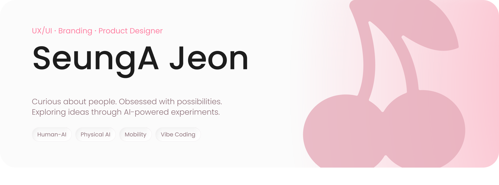

<picture>
  <source media="(prefers-color-scheme: dark)" srcset="./assets/title-dark.png">
  
</picture>

 

## 🍒 Selected Works

<a href="https://github.com/cherrymixy/Cature"><picture><source media="(prefers-color-scheme: dark)" srcset="./assets/w01-dark.png"></picture></a><a href="https://github.com/cherrymixy/black-magic"><picture><source media="(prefers-color-scheme: dark)" srcset="./assets/w02-dark.png"></picture></a>
<a href="https://github.com/cherrymixy/GrapeVine"><picture><source media="(prefers-color-scheme: dark)" srcset="./assets/w03-dark.png"></picture></a><a href="https://github.com/cherrymixy/HAL9000"><picture><source media="(prefers-color-scheme: dark)" srcset="./assets/w04-dark.png"></picture></a>
<a href="https://github.com/cherrymixy/fitzy"><picture><source media="(prefers-color-scheme: dark)" srcset="./assets/w05-dark.png"></picture></a><a href="https://github.com/cherrymixy/ABA"><picture><source media="(prefers-color-scheme: dark)" srcset="./assets/w06-dark.png"></picture></a>

 

## 🧰 Toolbox

**G&nbsp;R&nbsp;A&nbsp;P&nbsp;H&nbsp;I&nbsp;C**

&nbsp;&nbsp;&nbsp; &nbsp;&nbsp;&nbsp; &nbsp;&nbsp;&nbsp;   &nbsp;&nbsp;&nbsp; &nbsp;&nbsp;&nbsp; &nbsp;&nbsp;&nbsp; 

→ Unreal Engine 학습 중

**G&nbsp;E&nbsp;N&nbsp;E&nbsp;R&nbsp;A&nbsp;T&nbsp;I&nbsp;V&nbsp;E&nbsp; &nbsp;A&nbsp;I**

&nbsp;&nbsp;&nbsp; &nbsp;&nbsp;&nbsp; &nbsp;&nbsp;&nbsp; &nbsp;&nbsp;&nbsp; &nbsp;&nbsp;&nbsp; 

→ Weavy · Vizcom · Magnific · Nano Banana Pro · ChatGPT · Claude · Gemini · Perplexity

**V&nbsp;I&nbsp;B&nbsp;E&nbsp; &nbsp;C&nbsp;O&nbsp;D&nbsp;I&nbsp;N&nbsp;G**

&nbsp;&nbsp;&nbsp; &nbsp;&nbsp;&nbsp; &nbsp;&nbsp;&nbsp; 

**O&nbsp;A**

&nbsp;&nbsp;&nbsp; &nbsp;&nbsp;&nbsp; &nbsp;&nbsp;&nbsp; &nbsp;&nbsp;&nbsp; 

 

## 🌱 Now

 

 

