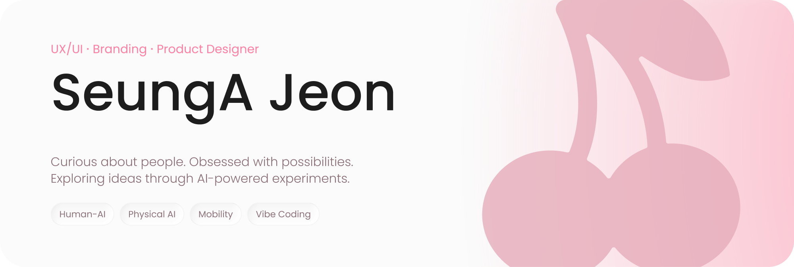
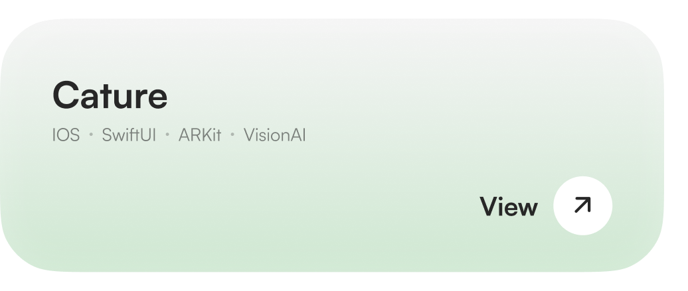
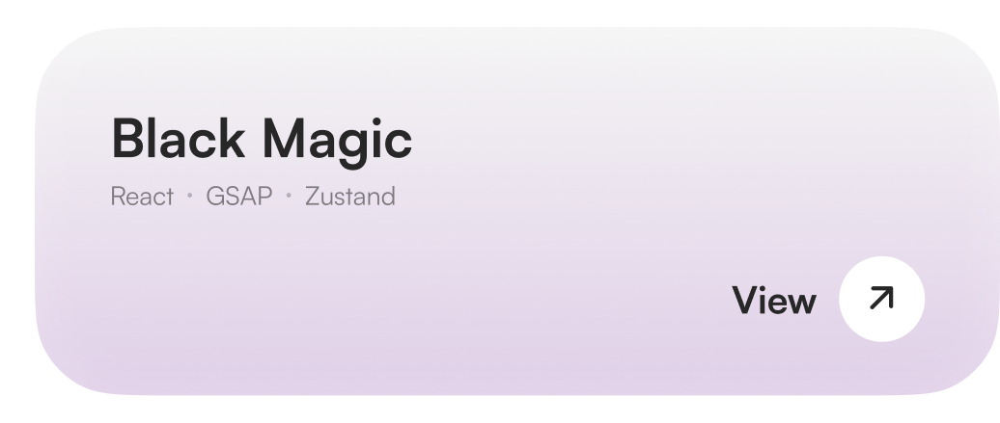
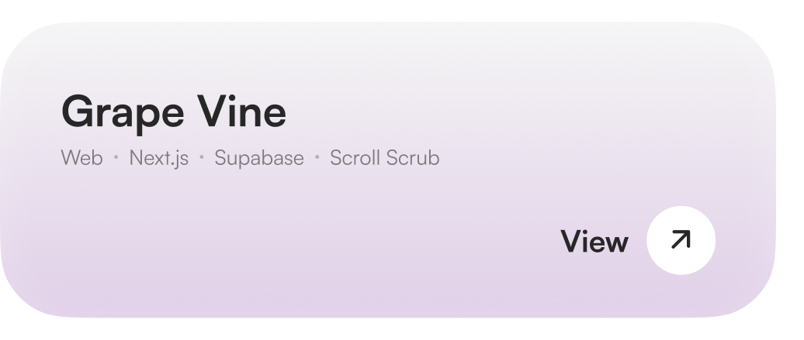
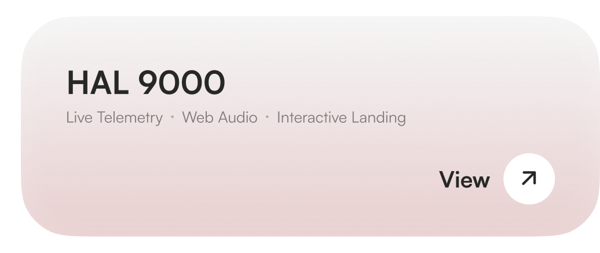
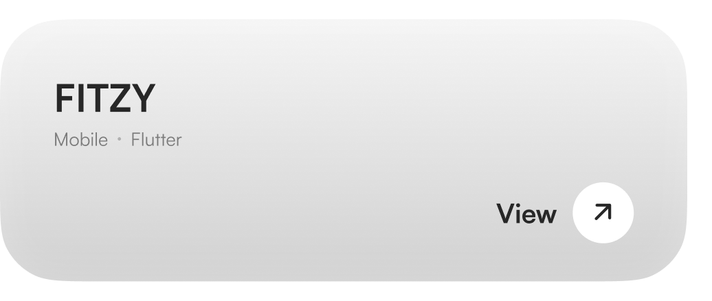
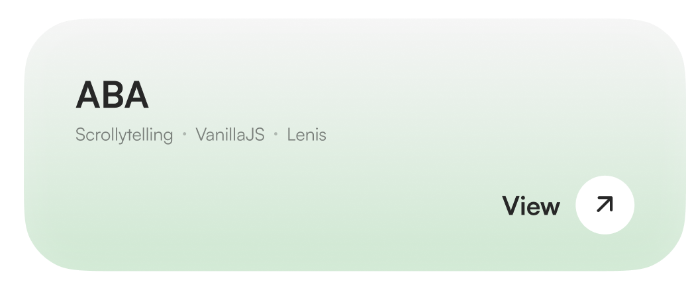

<picture>
  <source media="(prefers-color-scheme: dark)" srcset="./assets/hero-dark.png">
  
</picture>

 

 

## 🍒 Selected Works

<a href="https://github.com/cherrymixy/Cature"><picture><source media="(prefers-color-scheme: dark)" srcset="./assets/w01-dark.png"></picture></a><a href="https://github.com/cherrymixy/black-magic"><picture><source media="(prefers-color-scheme: dark)" srcset="./assets/w02-dark.png"></picture></a>
<a href="https://github.com/cherrymixy/GrapeVine"><picture><source media="(prefers-color-scheme: dark)" srcset="./assets/w03-dark.png"></picture></a><a href="https://github.com/cherrymixy/HAL9000"><picture><source media="(prefers-color-scheme: dark)" srcset="./assets/w04-dark.png"></picture></a>
<a href="https://github.com/cherrymixy/fitzy"><picture><source media="(prefers-color-scheme: dark)" srcset="./assets/w05-dark.png"></picture></a><a href="https://github.com/cherrymixy/ABA"><picture><source media="(prefers-color-scheme: dark)" srcset="./assets/w06-dark.png"></picture></a>

 

## 🧰 Toolbox

**D E S I G N**

**B U I L D&nbsp;&nbsp;W I T H&nbsp;&nbsp;A I**

**S H I P**

 

## 🌱 Now

 

